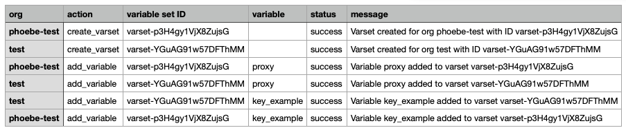
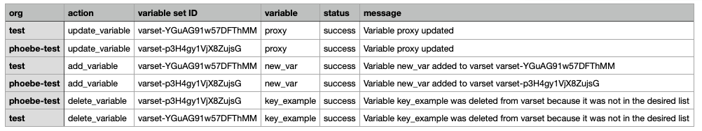
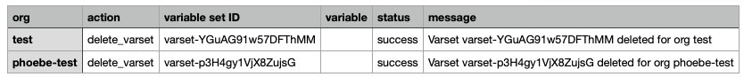

# create-priority-varset

This script automates the management of global priority variable sets (varsets) across all organizations in a Terraform Enterprise (TFE) instance.  
It supports creating, updating, and deleting a specific global priority varset for each organization, and synchronizes the variables within the varset according to a predefined configuration.

## Features

- Creates a global, priority varset with a specified name and description for each organization.
- Adds predefined variables to the varset, with support for variable attributes such as sensitivity, category, and HCL flag.
- Updates existing varsets by comparing current variables with the desired configuration, adding new variables, updating changed ones, and deleting variables not present in the desired list.
- Deletes the global priority varset from each organization if requested.
- Handles API authentication via an admin token, via prompting or environment variable: `TFE_ADMIN_TOKEN`.
- Supports dry-run mode to preview changes without making modifications.
- Uses multithreading to process multiple organizations concurrently for improved performance.
- Logs detailed output to both the console and a log file.
- Reports total script runtime at completion.
- Generates a CSV report (`varset_report.csv`) summarizing all actions, changes, and errors for each organization and variable.
- Validates configuration at startup for required fields and correct types.

## Usage Flow

1. **Create:**  
   Start by running the script with `--mode create` to create the global priority varset and add the initial set of variables to each organization.
2. **Update:**  
   When you want to synchronize or change the variables in the varset (add, update, or remove variables), run the script with `--mode update`.
3. **Delete:**  
   If you need to remove the global priority varset from organizations, run the script with `--mode delete`.

## Usage

```sh
python create-varset.py --mode [create|update|delete] --config CONFIG_FILE [--orgs ORGS] [--dry-run] [--log-level LEVEL] [--max-workers N]
```

### Arguments

- `--mode`: Operation mode.  
    - `'create'`: Create the global priority varset and add variables (default).
    - `'update'`: Synchronize variables in the varset with the desired configuration.
    - `'delete'`: Delete the global priority varset from each organization.
- `--config`: Path to YAML config file (required).
- `--orgs`: Path to a file with org names (one per line) or comma-separated list of org names.
- `--dry-run`: Show what would change, but do not make any changes.
- `--log-level`: Set the logging level (`DEBUG`, `INFO`, `WARNING`, `ERROR`, `CRITICAL`).
- `--max-workers`: Number of concurrent threads to use for processing organizations (default: 5).

### Environment

- Requires an admin API token for authentication.
- Set the token using the `TFE_ADMIN_TOKEN` environment variable, or you will be prompted securely.

### Notes

- Sensitive variable values cannot be read back from the API; updates may overwrite them.
- Designed for administrative use; use with caution in production environments.
- Everything will be logged to both the console and `execution.log`.
- A CSV report of all actions and errors will be written to `varset_report.csv`.
- **Organization selection precedence:**
    1. If the optional `--orgs` flag is provided:
        - If the value is a path to a file, each line in the file is treated as an organization name.
        - Otherwise, the value is parsed as a comma-separated list of organization names (e.g., `org1,org2,org3`).
    2. If `--orgs` is not provided, but the config file (provided via `--config`) contains an `organizations` key, those organizations are used.
    3. If neither of the above are provided, the script will fetch and process all organizations available in the TFE instance.

## Example config file (YAML)

Example also found in `config.yml.example`
```yaml
tfe_url: https://my-tfe.com
varset_name: global-proxy-override
varset_description: Global proxy override varset for proxy
organizations:
  - org-001
  - org-002
varset_vars:
  - key: proxy
    value: https://proxy.example.com:8080
    description: Proxy for this and that
    sensitive: false
    category: terraform
    hcl: false
  - key: key_example
    value: 61e400d5ccffb3782f215344481e6c82
```

## Example Output & CSV Reports (varset_report.csv)
<details>

<summary>Example `--mode=create` output</summary>

```
python3 create-varset.py --mode=create --config=config.yml --orgs phoebe-test,test
2025-05-22 14:16:54,204 - MainThread - INFO - Found 2 orgs
2025-05-22 14:16:54,204 - MainThread - INFO - Orgs: ['phoebe-test', 'test']
2025-05-22 14:16:54,205 - ThreadPoolExecutor-0_0 - INFO - Processing org: phoebe-test
2025-05-22 14:16:54,205 - ThreadPoolExecutor-0_0 - INFO - Creating global priority varset for org phoebe-test...
2025-05-22 14:16:54,205 - ThreadPoolExecutor-0_1 - INFO - Processing org: test
2025-05-22 14:16:54,205 - ThreadPoolExecutor-0_1 - INFO - Creating global priority varset for org test...
2025-05-22 14:16:54,377 - ThreadPoolExecutor-0_0 - INFO - Varset created for org phoebe-test with ID varset-p3H4gy1VjX8ZujsG
2025-05-22 14:16:54,378 - ThreadPoolExecutor-0_1 - INFO - Varset created for org test with ID varset-YGuAG91w57DFThMM
2025-05-22 14:16:54,525 - ThreadPoolExecutor-0_0 - INFO - + Variable proxy added to varset varset-p3H4gy1VjX8ZujsG
2025-05-22 14:16:54,526 - ThreadPoolExecutor-0_1 - INFO - + Variable proxy added to varset varset-YGuAG91w57DFThMM
2025-05-22 14:16:54,676 - ThreadPoolExecutor-0_1 - INFO - + Variable key_example added to varset varset-YGuAG91w57DFThMM
2025-05-22 14:16:54,677 - ThreadPoolExecutor-0_0 - INFO - + Variable key_example added to varset varset-p3H4gy1VjX8ZujsG
2025-05-22 14:16:55,186 - MainThread - INFO - [1/2] Finished processing org
2025-05-22 14:16:55,187 - MainThread - INFO - [2/2] Finished processing org
2025-05-22 14:16:55,188 - MainThread - INFO - CSV report written to varset_report.csv
2025-05-22 14:16:55,188 - MainThread - INFO - All actions completed successfully.
2025-05-22 14:16:55,188 - MainThread - INFO - Total script runtime: 0.98 seconds
```



</details>

<details>

<summary>Example `--mode=update` output</summary>

```
python3 create-varset.py --mode=update --config=config.yml --orgs phoebe-test,test 
2025-05-22 14:18:50,652 - MainThread - INFO - Found 2 orgs
2025-05-22 14:18:50,652 - MainThread - INFO - Orgs: ['phoebe-test', 'test']
2025-05-22 14:18:50,652 - ThreadPoolExecutor-0_0 - INFO - Processing org: phoebe-test
2025-05-22 14:18:50,653 - ThreadPoolExecutor-0_1 - INFO - Processing org: test
2025-05-22 14:18:50,653 - ThreadPoolExecutor-0_0 - INFO - Updating varset for org phoebe-test...
2025-05-22 14:18:50,653 - ThreadPoolExecutor-0_1 - INFO - Updating varset for org test...
2025-05-22 14:18:51,231 - ThreadPoolExecutor-0_1 - INFO - ~ Variable proxy updated
2025-05-22 14:18:51,256 - ThreadPoolExecutor-0_0 - INFO - ~ Variable proxy updated
2025-05-22 14:18:51,371 - ThreadPoolExecutor-0_1 - INFO - + Variable new_var added to varset varset-YGuAG91w57DFThMM
2025-05-22 14:18:51,373 - ThreadPoolExecutor-0_0 - INFO - + Variable new_var added to varset varset-p3H4gy1VjX8ZujsG
2025-05-22 14:18:51,497 - ThreadPoolExecutor-0_0 - INFO - - Variable key_example was deleted from varset because it was not in the desired list
2025-05-22 14:18:51,497 - ThreadPoolExecutor-0_1 - INFO - - Variable key_example was deleted from varset because it was not in the desired list
2025-05-22 14:18:52,003 - MainThread - INFO - [1/2] Finished processing org
2025-05-22 14:18:52,004 - MainThread - INFO - [2/2] Finished processing org
2025-05-22 14:18:52,006 - MainThread - INFO - CSV report written to varset_report.csv
2025-05-22 14:18:52,007 - MainThread - INFO - All actions completed successfully.
2025-05-22 14:18:52,007 - MainThread - INFO - Total script runtime: 1.35 seconds
```



</details>

<details>

<summary>Example `--mode=delete` output</summary>

```
python3 create-varset.py --mode=delete --config=config.yml --orgs phoebe-test,test
2025-05-22 14:19:16,362 - MainThread - INFO - Found 2 orgs
2025-05-22 14:19:16,362 - MainThread - INFO - Orgs: ['phoebe-test', 'test']

WARNING: You are about to DELETE the global priority varset from 2 organizations. This action is irreversible.
Type 'yes' to continue: yes
2025-05-22 14:19:17,139 - ThreadPoolExecutor-0_0 - INFO - Processing org: phoebe-test
2025-05-22 14:19:17,139 - ThreadPoolExecutor-0_1 - INFO - Processing org: test
2025-05-22 14:19:17,139 - ThreadPoolExecutor-0_1 - INFO - Deleting varset for org test...
2025-05-22 14:19:17,139 - ThreadPoolExecutor-0_0 - INFO - Deleting varset for org phoebe-test...
2025-05-22 14:19:17,444 - ThreadPoolExecutor-0_1 - INFO - - Varset varset-YGuAG91w57DFThMM deleted for org test
2025-05-22 14:19:17,456 - ThreadPoolExecutor-0_0 - INFO - - Varset varset-p3H4gy1VjX8ZujsG deleted for org phoebe-test
2025-05-22 14:19:17,947 - MainThread - INFO - [1/2] Finished processing org
2025-05-22 14:19:17,964 - MainThread - INFO - [2/2] Finished processing org
2025-05-22 14:19:17,968 - MainThread - INFO - CSV report written to varset_report.csv
2025-05-22 14:19:17,968 - MainThread - INFO - All actions completed successfully.
2025-05-22 14:19:17,968 - MainThread - INFO - Total script runtime: 1.61 seconds
```



</details>
